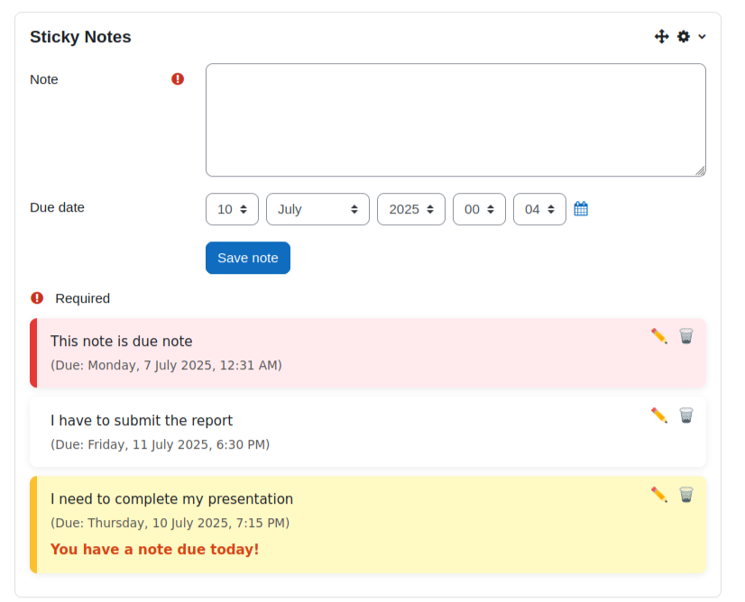

# Sticky Notes Block for Moodle 
A personal sticky notes block plugin for Moodle that allows users (admins, teachers, and students) to create, edit, and manage sticky notes on their dashboard. Notes include due dates, reminders, and a colorful card-style UI to help users stay organized.
This block is especially helpful for remembering important tasks, deadlines, and personal notes—making it easy to revisit them later whenever needed.

## 📑 Table of Contents

- [Installation Guide](#installation-guide)
- [Usage](#usage)
- [Tech Stack](#tech-stack)
- [Diagrams](#diagrams)
- [Resources](#resources)

## ⚙️ Installation Guide

To install and run the **Sticky Notes** Moodle block plugin, follow these steps.
### ✅ Prerequisites
- Moodle should be version 4.0.1 or above to ensure plugin compatibility.
- Ubuntu 20.04 or later is recommended for running the plugin smoothly.
- Apache2 and MySQL must be installed and properly configured.
- You need admin access to your Moodle site to install and manage the plugin.
- A working Moodle setup is required before installing the Sticky Notes block.

### 🔧 Steps to Install

1. **Download the Plugin**

   Clone or download the plugin from GitHub:
   ```bash
   git clone https://github.com/yourusername/block_stickynotes.git
2. **Place in Moodle Directory**

   Move the downloaded plugin into your Moodle blocks/ folder:

   ```bash
   mv block_stickynotes /path/to/your/moodle/blocks/
3. **Start Required Services**

   Ensure Apache and MySQL are running:
  
   ```bash
   sudo systemctl start apache2 
   sudo sysctemctl start mysql
    ```
4. **Access Moodle in Your Browser**

   Navigate to your Moodle site (e.g., http://localhost/moodle) and log in as an Administrator.
5. **Install the Plugin**

   Go to:
   ```bash
   Site administration > Notifications
   ```
   Moodle will detect the plugin automatically. Click “Upgrade database now”.

6. **Add Sticky Notes Block**

- After installation, go to your dashboard.
- Switch to Edit mode.
- Add the Sticky Notes block to the dashboard.
## 📖 Usage

After installing and enabling the Sticky Notes block:

1. Log in to your Moodle site as any user (Admin, Teacher, or Student).
2. Go to the Dashboard, turn editing on, then click “Add a block” and select Sticky Notes.
3. The block will appear—now you can:
 - 📝 Add a new note with a due date.
 - ✏️ Edit an existing note.
 - 🗑️ Delete a note.
 - 📅 See visual reminders for notes due today or overdue.
4. Notes are private—only visible to the user who created them.

### Sticky notes plugin


## 🛠️ Tech Stack

This plugin was developed using the following technologies and tools:

- Moodle Plugin Framework – Core structure and integration with the Moodle system.
- PHP – Backend logic and Moodle API interaction.
- XAMPP – Local development environment (Apache + MySQL + PHP).
- HTML, CSS, JavaScript – Frontend design and interactivity for the sticky notes.
- MySQL – For storing user-specific note data using Moodle's built-in database layer.
- Bootstrap – To maintain UI consistency with the Moodle platform.

## 🧱 Diagrams
### Use Case Diagram
.png)
### Sequence Diagram
.png)


## 🔍 Technical Decisions & Justifications

- Moodle API: Used to access user information and securely store notes, ensuring compliance with Moodle's coding standards.
- Block Plugin Type: Chosen because it's best suited for UI-based tools that appear on dashboards or course pages.
- Custom DB Table: Designed to store user-specific sticky notes without interfering with Moodle’s core tables.

## 📚 Resources

Helpful references and documentation used during development:

- [PHP Manual](https://www.php.net/manual/en/)
- [W3Schools PHP Tutorial](https://www.w3schools.com/php/)
- [Moodle Developer Docs](https://moodledev.io/)
